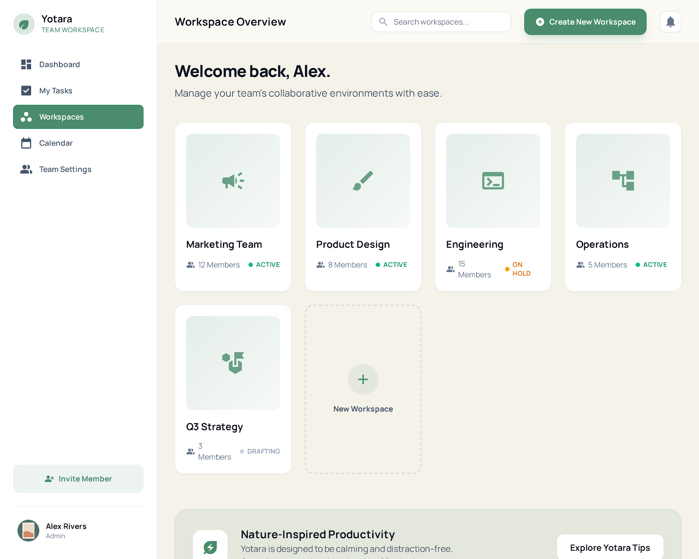
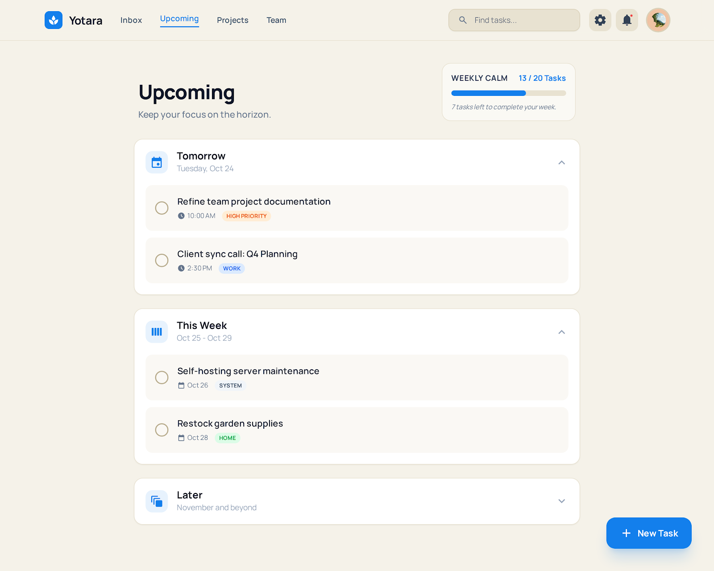

# Yotara

<div align="center">


<h1>Yotara</h1>

<p>A calm, self-hosted task manager for focused people and quiet teams.</p>

<p>
  <a href="https://github.com/apauldev/Yotara/actions"></a>
  <a href="./LICENSE"></a>
  <a href="https://github.com/apauldev/Yotara/releases"></a>
  <a href="https://github.com/apauldev/Yotara/security"></a>
</p>

<p>
  <a href="./PROJECT_README.md">Project Guide</a> &bull;
  <a href="./docs/ARCHITECTURE.md">Architecture</a> &bull;
  <a href="./CONTRIBUTING.md">Contributing</a> &bull;
  <a href="https://github.com/apauldev/Yotara/issues">Issues</a>
</p>

</div>

---

## What is Yotara?

Yotara is a self-hosted task manager built for people who want structure without feeling managed by the software. It sits between minimalist to-do lists and heavy project management suites, keeping the useful parts and leaving the noise behind.

**Personal mode** is the focus today. **Team collaboration** appears only when needed.

---

## Features

| Feature | Description |
|:---|:---|
| **Inbox** | Capture everything now, sort later. A soft landing for incoming thoughts. |
| **Today** | See what matters right now. Tasks due today or marked for today. |
| **Upcoming** | Plan your week. Tasks grouped by due date. |
| **Projects** | Group related tasks. Custom colors, task counts, soft delete. |
| **Labels** | Categorize tasks across projects. Multi-label support. |
| **Archive** | Completed tasks move here. Restore or permanently delete. |
| **Search** | Full-text search across tasks, projects, and labels. |
| **Recurring Tasks** | Daily, weekly, monthly, or yearly repetition with edge-case handling. |
| **Subtasks** | Break big tasks into smaller steps. One level of nesting. |
| **Simple Mode** | Hide complexity when you just need a list. |
| **Dark Mode** | 7 themes. Light, dark, and everything between. |
| **Keyboard Shortcuts** | Navigate without touching the mouse. |

---

## Tech Stack

| Layer | Technology |
|:---|:---|
| **Frontend** | [Angular 21](https://angular.dev) (standalone, signals, lazy routes) |
| **Backend** | [Fastify 5](https://www.fastify.io) + [TypeScript](https://www.typescriptlang.org) |
| **Auth** | [Better Auth](https://www.better-auth.com) (session cookies, CORS, CSRF) |
| **Database** | [SQLite](https://www.sqlite.org) + [Drizzle ORM](https://orm.drizzle.team) |
| **Styling** | [Tailwind CSS](https://tailwindcss.com) + CSS custom properties |
| **Icons** | [Font Awesome](https://fontawesome.com) |
| **DevOps** | [Docker](https://www.docker.com), [pnpm](https://pnpm.io), [GitHub Actions](https://github.com/features/actions) |

---

## Quick Start

```bash
git clone https://github.com/apauldev/Yotara.git
cd Yotara
pnpm install
pnpm dev
```

This starts:
- **Frontend:** http://localhost:4200
- **API:** http://localhost:3000
- **Drizzle Studio:** https://local.drizzle.studio

Environment variables (`BETTER_AUTH_SECRET`, `DATABASE_URL`, etc.) can be
set in your shell or sourced from [`apps/api/.env.example`](./apps/api/.env.example).

For Docker deployment, see [DOCKER.md](./DOCKER.md).

---

## Screenshots

<p align="center">
  
  
</p>

---

## Project Structure

```
Yotara/
  apps/
    api/              Fastify + Drizzle backend
    frontend/         Angular 21 frontend
  packages/
    shared/           Domain types, DTOs, auth client
  docs/
    ARCHITECTURE.md   Technical roadmap and anti-patterns
  scripts/            Release automation
```

See [PROJECT_README.md](./PROJECT_README.md) for detailed documentation.

---

## Contributing

We welcome contributions. Start here:

1. **[Architecture](./docs/ARCHITECTURE.md)** -- understand the current state and planned work
2. **[Good First Issues](https://github.com/apauldev/Yotara/issues?q=is%3Aissue+is%3Aopen+label%3A%22good+first+issue%22)** -- pick up a small task
3. **[Contributing Guide](./CONTRIBUTING.md)** -- setup, standards, and PR process

---

## Security

If you discover a security vulnerability, please report it privately. See [SECURITY.md](./SECURITY.md) for details.

---

## Versioning

Yotara follows [Semantic Versioning](https://semver.org/) with [Conventional Commits](https://www.conventionalcommits.org/). Releases are automated via GitHub Actions.

| Commit Type | Version Bump |
|:---|:---|
| `feat:` | Minor |
| `fix:` | Patch |
| `feat!:` or `fix!:` | Major |

---

## License

[MIT](./LICENSE)
