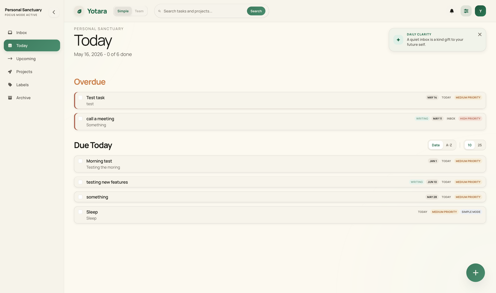

# Yotara

<div align="center">


<p>
  <a href="./PROJECT_README.md"></a>
  <a href="./CONTRIBUTING.md"></a>
  <a href="#contributors"></a>
  
  
  
</p>

<h3>A calm, self-hosted task manager for focused individuals and lightweight teams.</h3>

<p>
  Yotara is built for the space between personal to-do apps and bloated team software:
  clean enough for one person, collaborative enough for a small group, and fully under your control.
</p>

<p>
  <a href="./PROJECT_README.md"><strong>Run Locally</strong></a>
  ·
  <a href="#why-yotara"><strong>Why Yotara</strong></a>
  ·
  <a href="#current-build"><strong>Current Build</strong></a>
  ·
  <a href="./docs/personal-mode-mvp.md"><strong>Personal Mode MVP</strong></a>
  ·
  <a href="./ROADMAP.md"><strong>MVP Roadmap</strong></a>
  ·
  <a href="./CONTRIBUTING.md"><strong>Contributing</strong></a>
  ·
  <a href="#product-direction"><strong>Direction</strong></a>
</p>

</div>

---

## Why Yotara

Most task software breaks down in one of two ways:

- personal apps are elegant until you need to share work
- team tools become process-heavy before the work is even complicated

Yotara is being built in the gap between those extremes. The goal is a product that feels quiet, fast, and obvious for individual use, but can stretch into small-team collaboration without turning into management software.

<table>
  <tr>
    <td width="33%">
      <h3>Personal First</h3>
      <p>Start with a clean daily workflow instead of an empty enterprise dashboard.</p>
    </td>
    <td width="33%">
      <h3>Team Ready</h3>
      <p>Share work when needed without dragging in sprints, epics, or ceremony.</p>
    </td>
    <td width="33%">
      <h3>Own Your Data</h3>
      <p>Self-hosted by design, with a stack that stays approachable and portable.</p>
    </td>
  </tr>
</table>

## At A Glance

<p align="center">
  
  
  
  
  
  
  
  
</p>

## Current Build

What is already present in the repository today:

| Area | Current State |
| --- | --- |
| Frontend | Angular app with standalone components and route-based flows |
| Auth | Better Auth email/password sign-up and sign-in |
| Onboarding | Personal vs team mode picker |
| Personal Mode | Dedicated shell with Inbox, Today, Upcoming, Projects, and Labels |
| Team Mode | Authenticated left-nav shell for `/dashboard` |
| Tasks | Task CRUD plus personal metadata capture via modal |
| Backend | Fastify API with protected `/tasks` and `/me` routes |
| Data | SQLite + Drizzle with bootstrapped schema |
| Monorepo | pnpm workspaces with shared TypeScript package |

### Implemented Flows

- create an account or sign in with email and password
- pass through onboarding and choose a personal or team workspace mode
- land in a mode-aware authenticated shell after onboarding
- use personal routes for `Inbox`, `Today`, `Upcoming`, `Projects`, and `Labels`
- use the team dashboard shell with desktop and mobile navigation
- create, update, fetch, and delete user-scoped tasks through the API
- capture richer task metadata including description, priority, due date, simple mode, and buckets

### Personal Mode Highlights

- personal users now default into `/inbox`
- Inbox supports quick capture plus a richer task modal
- Today and Upcoming are driven by task status and due-date selectors
- Projects and Labels have real placeholder routes and UI
- Daily clarity and Yotara Journal prompts rotate from built-in prompt pools

### Task Metadata Supported Today

- title
- description
- status: `inbox | today | upcoming | done | archived`
- priority: `low | medium | high`
- due date
- simple mode
- bucket: `personal-sanctuary | deep-work | home | health`
- completion state
- sort order

## Visual Preview

<p align="center">
  
  
</p>

<p align="center">
  
</p>

<p align="center">
  <sub>
    Current local build previews showing the shipped personal-mode experience.
  </sub>
</p>

## Product Direction

Yotara is early, but the direction is intentional.

**For a complete technical breakdown of all planned screens, components, and build phases, see the [MVP Roadmap](./ROADMAP.md).**

### Core experience

- Inbox, Today, and Upcoming task flows
- projects, labels, priorities, subtasks, and recurring work
- richer task details and notes
- board and list organization

### Lightweight collaboration

- shared workspaces for small teams
- assignment and comments
- live updates without heavyweight PM workflows

### What it is explicitly not trying to become

- an all-in-one enterprise planning suite
- a process-first project management tool
- a product full of dashboards before the core workflow feels good

## Stack

<p align="center">
  
</p>

<p align="center">
  Built with <strong>Angular 21</strong>, <strong>Fastify</strong>, <strong>Better Auth</strong>, <strong>Drizzle ORM</strong>, <strong>SQLite</strong>, and <strong>pnpm workspaces</strong>.
</p>

## Repo Shape

```text
.
├── apps/
│   ├── frontend/   # Angular application
│   └── api/        # Fastify backend
├── packages/
│   └── shared/     # shared auth and task types
└── scripts/        # development helpers
```

## Run And Development Guide

The main README stays product-facing. Full setup, scripts, environment variables, API notes, database details, and testing instructions live in:

### [`PROJECT_README.md`](./PROJECT_README.md)

That guide covers:

- installation and local development
- workspace structure
- environment variables and auth origins
- database behavior and Drizzle Studio
- API routes and current architecture
- testing and verification commands

Additional implementation notes:

- [Personal Mode MVP](./docs/personal-mode-mvp.md)
- [Task API examples](./PROJECT_README.md#task-api-examples)

## API Examples

All task endpoints require authentication. Pass your session cookie with every request.

> The API runs at `http://localhost:3000` by default. See [`PROJECT_README.md`](./PROJECT_README.md) for setup.

### Create a task

```bash
curl -X POST http://localhost:3000/tasks \
  -H "Content-Type: application/json" \
  -b "better-auth.session_token=YOUR_SESSION_TOKEN" \
  -d '{
    "title": "Write contribution guide",
    "status": "today",
    "priority": "high",
    "bucket": "deep-work"
  }'
```

```js
const res = await fetch("http://localhost:3000/tasks", {
  method: "POST",
  headers: { "Content-Type": "application/json" },
  credentials: "include",
  body: JSON.stringify({
    title: "Write contribution guide",
    status: "today",
    priority: "high",
    bucket: "deep-work",
  }),
});
const task = await res.json(); // → { id, title, status, priority, ... }
```

### List tasks

```bash
curl http://localhost:3000/tasks?page=1&pageSize=10 \
  -b "better-auth.session_token=YOUR_SESSION_TOKEN"
```

```js
const res = await fetch("http://localhost:3000/tasks?page=1&pageSize=10", {
  credentials: "include",
});
const { data, meta } = await res.json();
// data  → Task[]
// meta  → { total, page, pageSize, totalPages, hasNextPage, hasPreviousPage }
```

### Fetch a single task

```bash
curl http://localhost:3000/tasks/TASK_ID \
  -b "better-auth.session_token=YOUR_SESSION_TOKEN"
```

```js
const res = await fetch("http://localhost:3000/tasks/TASK_ID", {
  credentials: "include",
});
const task = await res.json(); // → { id, title, status, priority, ... }
```

### Update a task

```bash
curl -X PATCH http://localhost:3000/tasks/TASK_ID \
  -H "Content-Type: application/json" \
  -b "better-auth.session_token=YOUR_SESSION_TOKEN" \
  -d '{
    "completed": true,
    "priority": "low"
  }'
```

```js
const res = await fetch("http://localhost:3000/tasks/TASK_ID", {
  method: "PATCH",
  headers: { "Content-Type": "application/json" },
  credentials: "include",
  body: JSON.stringify({ completed: true, priority: "low" }),
});
const updated = await res.json(); // → updated task object
```

### Delete a task

```bash
curl -X DELETE http://localhost:3000/tasks/TASK_ID \
  -b "better-auth.session_token=YOUR_SESSION_TOKEN"
```

```js
const res = await fetch("http://localhost:3000/tasks/TASK_ID", {
  method: "DELETE",
  credentials: "include",
});
const result = await res.json(); // → { ok: true }
```

---

## Why Watch Or Contribute

- You want a self-hosted task tool that does not feel like admin software.
- You like modern TypeScript stacks but still want a product with a clear point of view.
- You want to contribute while product and UX decisions are still flexible enough to matter.

## Contributing

Contributions are welcome! Whether it's bug reports, feature ideas, code, or documentation, we'd love your help.

**New to the project?** Start here:
- [CONTRIBUTING.md](./CONTRIBUTING.md) — Setup guide, PR process, code standards
- [CODE_OF_CONDUCT.md](./CODE_OF_CONDUCT.md) — Community guidelines
- [ROADMAP.md](./ROADMAP.md) — What we're building and priority order

**Looking for something to work on?**
- Check issues labeled [`good-first-issue`](https://github.com/apauldev/Yotara/labels/good-first-issue)
- Review the [ROADMAP.md](./ROADMAP.md) for planned features
- Open a discussion if you have questions

## Contributors

This project follows the [all-contributors](https://allcontributors.org) specification. Contributions of any kind are welcome.

<!-- ALL-CONTRIBUTORS-LIST:START - Do not remove or modify this section -->
<!-- prettier-ignore-start -->
<!-- markdownlint-disable -->
<table>
  <tbody>
    <tr>
      <td align="center" valign="top" width="14.28%"><a href="https://github.com/apauldev"><br /><sub><b>Arul</b></sub></a><br /><a href="https://github.com/apauldev/Yotara/commits?author=apauldev" title="Code">💻</a> <a href="https://github.com/apauldev/Yotara/commits?author=apauldev" title="Documentation">📖</a> <a href="#design-apauldev" title="Design">🎨</a> <a href="#ideas-apauldev" title="Ideas, Planning, & Feedback">🤔</a> <a href="#maintenance-apauldev" title="Maintenance">🚧</a></td>
      <td align="center" valign="top" width="14.28%"><a href="https://github.com/shivansh090"><br /><sub><b>Shivansh Vikram Singh</b></sub></a><br /><a href="https://github.com/apauldev/Yotara/commits?author=shivansh090" title="Documentation">📖</a></td>
    </tr>
  </tbody>
</table>

<!-- markdownlint-restore -->
<!-- prettier-ignore-end -->

<!-- ALL-CONTRIBUTORS-LIST:END -->

If you contribute and want to be added to the table, maintainers can run:

```bash
pnpm contributors:add <github-username> <contribution-type>
pnpm contributors:generate
```

## Status

Yotara is in active early development. This README reflects the current codebase and the intended direction of the product, not a claim that every planned feature is already shipped.

<div align="center">
  <sub>Built for focused work, not workflow theater.</sub>
</div>
