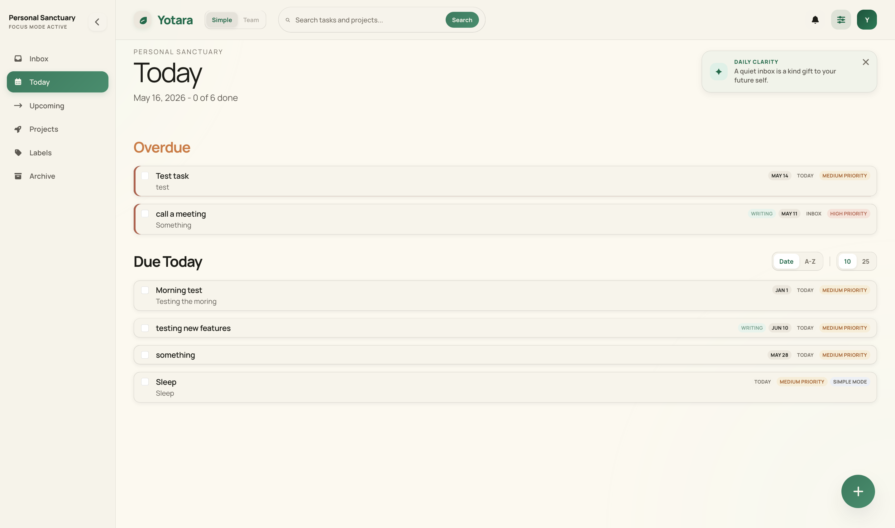
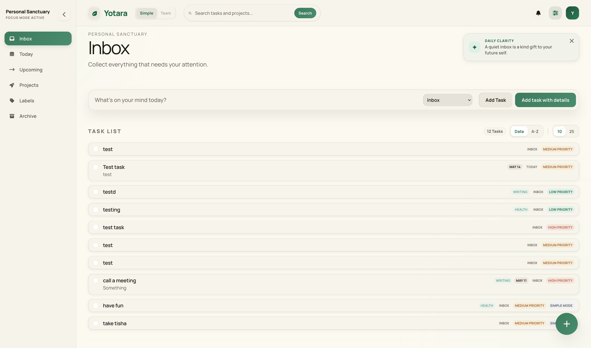
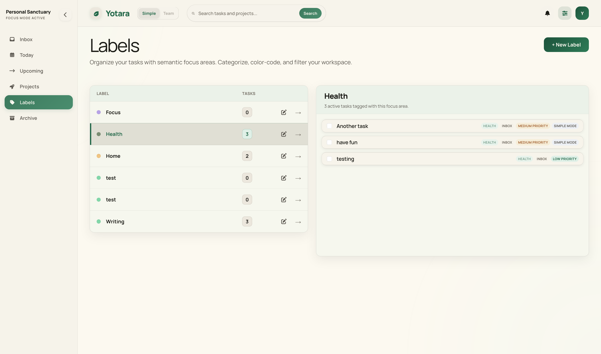

# Yotara

<div align="center">


## A calm, self-hosted task manager

Yotara helps focused people and **quiet teams** — small groups that share work without the overhead of project management — capture tasks, plan their week, and finish without the noise.

[Quick Start](#quick-start) &nbsp;·&nbsp; [Docs](./PROJECT_README.md) &nbsp;·&nbsp; [Demo](https://yotara.website)

<br />

<a href="https://github.com/apauldev/Yotara/actions"></a>
<a href="https://codecov.io/gh/apauldev/Yotara"></a>
<a href="https://github.com/apauldev/Yotara/releases"></a>
<a href="./LICENSE"></a>
<a href="https://github.com/apauldev/Yotara/security"></a>
<a href="https://github.com/apauldev/Yotara/graphs/contributors"></a>
<a href="https://github.com/apauldev/Yotara"></a>
<a href="https://yotara.website"></a>
<a href="./PROJECT_README.md"></a>
<a href="./docs/ARCHITECTURE.md"></a>
<a href="./CONTRIBUTING.md"></a>
<a href="https://github.com/apauldev/Yotara/issues?q=is%3Aissue+is%3Aopen+label%3A%22good+first+issue%22"></a>

</div>

---

## Screenshots

<p align="center">
  
  
</p>

<p align="center">
  
</p>

<p align="center"><sub><i>A calm, settled personal-mode experience.</i></sub></p>

---

## Who it's for

**Perfect for**

- Personal planning and daily focus
- Students, teachers, and researchers
- Consultants and freelancers
- Small teams and nonprofits

**Not ideal for**

- Scrum or SAFe organizations
- Enterprise portfolio management
- Heavy Agile workflows

---

## What to expect

- Designed for focused personal use and small-group sharing, not large enterprise programs.
- Team features are on the roadmap; the current experience is personal-first.
- Local-first deployment with SQLite and a portable monorepo stack.

---

## Why Yotara?

Not another todo app. Not another project management suite. Something in between that respects your attention.

| Instead of... | You get... |
|:---|---|
| **Hosted task managers** (Todoist, TickTick) — polished but SaaS, subscription fatigue, your data on their servers | Self-hosted, offline-capable SQLite, no recurring bills, full data ownership |
| **Vikunja / Plane** — powerful but heavy, complex UI, overkill for one person | Lightweight Angular + Fastify stack, Simple Mode when you just need a list |
| **Obsidian / Notion** — infinitely flexible but infinite setup, you spend more time organizing than doing | Opinionated defaults that work out of the box. Structure without the blank-page paralysis |
| **Paper / sticky notes** — no notifications, no search, no recurring tasks | Full-text search, smart filters, recurring tasks, keyboard shortcuts — but still calm |

> **Yotara is for:** makers, writers, students, freelancers, small teams, and anyone who needs task management that stays out of the way. If you have ever felt managed by your task manager, this is the antidote.

**The Yotara experience**

- **Personal first.** Inbox, Today, and Upcoming keep the next step visible without turning your workspace into a storm of widgets.
- **Sovereign data.** Self-hosted by design on a portable SQLite + Drizzle stack, so your data, privacy, and infrastructure stay in your hands.
- **Quiet performance.** Fast interactions powered by Angular and Fastify, tuned for low-friction navigation and responsive APIs.
- **Team mode is on the roadmap.** Personal mode is the focus today; shared workspaces are planned.

---

## Quick Start

Get Yotara running locally in under a minute. Requires Node `22.22.1+` and `pnpm` `10.30.3+`.

```bash
git clone https://github.com/apauldev/Yotara.git
cd Yotara
pnpm install
pnpm dev
```

`pnpm dev` starts three services in parallel from the repo root:

| Service | URL | Purpose |
|:---|:---|:---|
| **Frontend** | http://localhost:4200 | Angular dev server with hot reload |
| **API** | http://localhost:3000 | Fastify backend with auto-reload |
| **Drizzle Studio** | https://local.drizzle.studio | Database GUI for inspection |

> Note: `pnpm dev` runs three processes in parallel: `@yotara/frontend dev`, `@yotara/api dev`, and `@yotara/api db:studio` (studio is optional and only starts when available).

### Docker deployment

The stack runs behind a single nginx front on port 8080. Images total ~950 MB (api: ~875 MB, frontend: ~78 MB) and run in ~512 MB RAM.

```bash
# Generate a strong secret for signing session tokens
export BETTER_AUTH_SECRET=$(openssl rand -base64 32)

# Build and start
docker compose up --build -d

# Open http://localhost:8080
```

**`BETTER_AUTH_SECRET` is mandatory.** Compose fails fast with a clear error if it's unset, and the API refuses to boot with the old default placeholder. This key signs session tokens — without a strong secret, an attacker can forge sessions for any account. Set it on every deploy and never commit a real value.

The stack includes security hardening by default:

- **Security headers** on every response: `X-Content-Type-Options: nosniff`, `X-Frame-Options: DENY`, `Referrer-Policy: no-referrer`, `Content-Security-Policy` (single source of truth shared between the API and nginx; override once via `CONTENT_SECURITY_POLICY`)
- **Swagger UI** at `/docs` gated to localhost and private LAN ranges by default
- **Account lockout** keyed by (IP, email) — an attacker can't lock a victim from a different IP
- **Login rate limiting** with per-email attempt tracking

See [DOCKER.md](./DOCKER.md) for full deployment details, environment variables, and troubleshooting.

### Dev environment (without Docker)

```bash
cp apps/api/.env.example apps/api/.env
# Edit apps/api/.env to configure
pnpm dev
```

---

## Features

<details open>
<summary><b>Personal Productivity</b></summary>
<br />

| Feature | Description |
|:---|:---|
| **Inbox** | Capture everything now, sort later. A soft landing for incoming thoughts. |
| **Today** | See what matters right now. Tasks due today or marked for today. |
| **Upcoming** | Plan your week. Tasks grouped by due date with weekly rhythm. |
| **Projects** | Group related tasks. Custom colors, live task counts, soft delete. |
| **Labels** | Categorize tasks across projects. Multi-label support for cross-cutting concerns. |
| **Archive** | Completed tasks move here. Restore or permanently delete with full lifecycle management. |
| **Search** | Full-text search across tasks, projects, and labels with context highlighting. |

</details>

<details>
<summary><b>Smart Task Management</b></summary>
<br />

| Feature | Description |
|:---|:---|
| **Recurring Tasks** | Daily, weekly, monthly, or yearly with edge-case handling for month-ends and leap years. |
| **Subtasks** | Break big tasks into smaller steps. One level of nesting keeps it simple. |
| **Simple Mode** | Hide dates and metadata when you just need a flat list. Toggle per task. |
| **7 Themes** | Dark mode, light mode, and everything between. Custom CSS properties for your own. |
| **Keyboard Shortcuts** | Navigate every view without touching the mouse. Power-user speed. |
| **Daily Tips** | Rotating productivity prompts on login. A small nudge, not a notification. |

</details>

---

## Why these choices?

Yotara makes opinionated bets about its stack and deployment model. If you're curious about the reasoning:

- [Why SQLite?](https://yotara.website/blog) — zero-infrastructure, trivially backup-able, fast enough for one user.
- [Why self-host?](https://yotara.website/blog) — your data stays on your server, no telemetry, no lock-in.
- [Designing for Focus](https://yotara.website/blog) — how the interface stays out of your way.

---

## Tech Stack

<div align="center">

| Layer | Technology |
|:---|:---|
| **Frontend** | [Angular 21](https://angular.dev) (standalone, signals, lazy routes) |
| **Backend** | [Fastify 5](https://www.fastify.io) + [TypeScript](https://www.typescriptlang.org) |
| **Auth** | [Better Auth](https://www.better-auth.com) (session cookies, CORS, CSRF) |
| **Database** | [SQLite](https://www.sqlite.org) + [Drizzle ORM](https://orm.drizzle.team) |
| **Styling** | [Tailwind CSS](https://tailwindcss.com) + CSS custom properties |
| **Icons** | [Font Awesome](https://fontawesome.com) |
| **CI/CD** | [GitHub Actions](https://github.com/features/actions) + [Docker](https://www.docker.com) |
| **Package** | [pnpm](https://pnpm.io) workspaces |

<br />


</div>

---

## Engineering & DX

Yotara is built as a modern pnpm monorepo with shared packages, automated code quality, and consistent tooling.

- **API-first design** — fully documented OpenAPI/Swagger spec served from the Fastify backend, auto-generated.
- **Typed error system** — HTTP-status-aware error hierarchy. Meaningful 4xx responses instead of opaque 500s.
- **Docker first** — multi-stage Dockerfiles, Docker Compose, and CI smoke tests for production-ready deployment.
- **Automated releases** — semantic versioning from conventional commits. CI builds, tags, and publishes changelogs.

---

## Recent updates

A few fresh leaves on the branch. Yotara is actively developed and improving every sprint.

**Product**

- Recurring tasks with month-end and leap-year edge-case handling
- Archive, restore, and permanent delete with `archived_at` timestamps
- Server-side task pagination for thousands of tasks
- 7 themes with dark mode and custom CSS properties
- Full-text search across tasks, projects, and labels

**Engineering**

- Typed error hierarchy replacing bare `throw new Error` across the API
- Preferences Store centralizing all `localStorage` access into one injectable service
- Signal-driven UI replacing `setTimeout` hacks for loading bars and state
- Docker CI smoke tests building images and running a full-stack check before merge
- OpenAPI docs — auto-generated Swagger UI at `/docs` with full request/response schemas

---

<details>
<summary><b>Project structure</b></summary>

```text
Yotara/
  apps/
    api/                Fastify + Drizzle backend
      src/
        routes/         Route handlers (tasks, projects, labels, auth, me)
        services/       Business logic layer
        db/             Schema, migrations, client
        docs/           OpenAPI spec generation
      drizzle/          SQLite migrations
    frontend/           Angular 21 application
      src/app/
        core/           Auth guards, services, interceptors
        features/       Feature modules (personal, team, onboarding)
        shared/         Reusable UI primitives, pipes, directives
  packages/
    shared/             Domain types, DTOs, auth client
  docs/                 Architecture guide, roadmap, assets
  scripts/              Dev runner, release automation, versioning
```

</details>

<details>
<summary><b>Versioning</b></summary>

Yotara follows Semantic Versioning powered by Conventional Commits and automated release workflows.

| Commit Type | Bump | Example |
|:---|:---:|:---|
| `feat:` | Minor | `feat: add recurring task support` |
| `fix:` | Patch | `fix: correct date overflow in February` |
| `feat!:` or `fix!:` | Major | `feat!: redesign task data model` |
| `docs:`, `refactor:`, `test:` | Patch | `refactor: extract PreferencesStore` |

Automated releases run via GitHub Actions when code is merged to `main`. Docs-only and screenshot-only changes are skipped. The release workflow: version bump, changelog, tag, and GitHub Release. All hands-off.

</details>

---

## Contributing

Yotara is open source, and community care keeps it growing. We would love your help.

1. Start with the [Architecture Guide](./docs/ARCHITECTURE.md) to understand the lay of the land.
2. Browse [good first issues](https://github.com/apauldev/Yotara/issues?q=is%3Aissue+is%3Aopen+label%3A%22good+first+issue%22) to find something to work on.
3. Read the [Contributing Guide](./CONTRIBUTING.md) for setup, conventions, and PR process.

## Contributors

Yotara is built by these contributors:

<!-- ALL-CONTRIBUTORS-LIST:START - Do not remove or modify this section -->
<!-- prettier-ignore-start -->
<!-- markdownlint-disable -->
<table>
  <tbody>
    <tr>
      <td align="center" valign="top" width="14.28%"><a href="https://github.com/apauldev"><br /><sub><b>Arul</b></sub></a><br /><a href="https://github.com/apauldev/Yotara/commits?author=apauldev" title="Code">Code</a> <a href="https://github.com/apauldev/Yotara/commits?author=apauldev" title="Documentation">Docs</a> <a href="#design-apauldev" title="Design">Design</a> <a href="#ideas-apauldev" title="Ideas, Planning, & Feedback">Ideas</a> <a href="#maintenance-apauldev" title="Maintenance">Maintenance</a></td>
      <td align="center" valign="top" width="14.28%"><a href="https://github.com/shivansh090"><br /><sub><b>Shivansh Vikram Singh</b></sub></a><br /><a href="https://github.com/apauldev/Yotara/commits?author=shivansh090" title="Documentation">Docs</a></td>
    </tr>
  </tbody>
</table>

<!-- markdownlint-restore -->
<!-- prettier-ignore-end -->

<!-- ALL-CONTRIBUTORS-LIST:END -->

Want to see your name here? Check the [contributing guide](./CONTRIBUTING.md).

## Security

If you discover a security vulnerability, please report it privately via the [Security Policy](./SECURITY.md). Every report is taken seriously.

## License

[MIT](./LICENSE). Do what you like, just keep the license notice.

---

<div align="center">
  <br />
  <p><em>Built with care for focused work, one quiet task at a time.</em></p>
  
</div>
